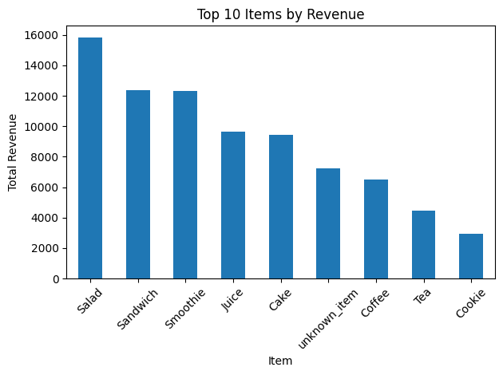
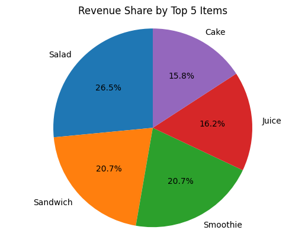

# Cafe Sales Data Cleaning & Analysis

## Overview

This project focuses on cleaning and analyzing a real-world messy cafe sales dataset using Python.
The goal is to transform raw, inconsistent data into a clean, reliable dataset and extract
basic business insights through visualizations.

---

## Data Cleaning Steps

- Normalized fake missing values (NA, UNKNOWN, ERROR, etc.)
- Fixed data types (numeric, datetime)
- Handled missing values using logical strategies
- Validated business logic (price × quantity = total spent)
- Standardized column names and categories
- Will try to add a predictive analytic model

---

## Visualizations

- Top 10 items by total revenue (Bar Chart)
- Revenue share of top 5 items (Pie Chart)

### Top Items by Revenue



### Revenue Share by Item



---

## Tech Stack

- Python
- Pandas
- Matplotlib
- Will be using flask or fastAPI
- Learning FLASK

---

## Project Structure
```
cafe-sales-analysis/
├── data/
│ ├── dirty_cafe_sales.csv
│ └── cleaned_cafe_sales.csv
├── plots/
│ ├── top_items_bar.png
│ └── revenue_share_pie.png
├── src/
│ └── clean_and_plot.py
├── README.md
└── requirements.txt
```
